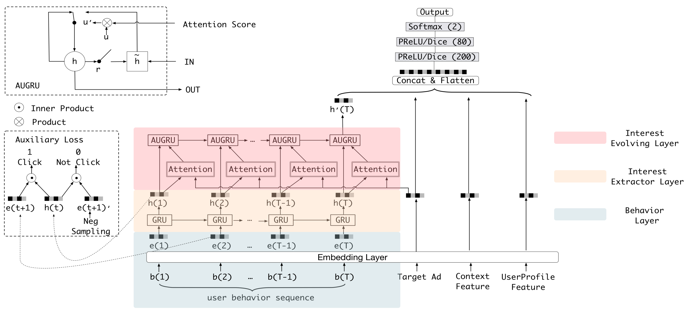

# DIEN模型复现（PyTorch）
DIEN（Deep Interest Evolution Network）是一种基于深度学习的点击率预测模型，核心是通过两层GRU和注意力机制建模用户兴趣随时间的演化。



TAGS: 排序、点击率预测、深度学习、兴趣建模、兴趣演变、GRU

## 数据集准备
把 DIN 使用的原始数据拷贝到 `DIEN.2018/raw_data/`：
- `reviews_Electronics_5.json` 或 `reviews_Electronics_5.json.gz`
- `meta_Electronics.json` 或 `meta_Electronics.json.gz`

## 数据预处理
建议始终在**仓库根目录**执行：

```bash
uv run python DIEN.2018/utils/1_convert_pd.py
uv run python DIEN.2018/utils/2_remap_id.py
uv run python DIEN.2018/utils/3_build_dataset.py
```

生成文件：
- `DIEN.2018/raw_data/reviews.pkl`
- `DIEN.2018/raw_data/meta.pkl`
- `DIEN.2018/raw_data/remap.pkl`
- `DIEN.2018/dataset.pkl`

### DIEN训练集格式
`train_set` 单条样本：
```text
(user_id, hist_items, neg_hist_items, target_item, label)
```

其中：
- `hist_items`: 正向历史序列
- `neg_hist_items`: 与历史时间步对齐的负样本序列（用于 auxiliary loss）

`test_set` 单条样本：
```text
(user_id, hist_items, neg_hist_items, (pos_item, neg_item))
```

## 训练
```bash
uv run python DIEN.2018/train.py
```

日志与模型输出：
- TensorBoard: `DIEN.2018/output/tb_logs/`
- Checkpoint: `DIEN.2018/output/checkpoint/`

## 模型文件
- `DIEN.2018/model.py`: DIEN 主模型
- `DIEN.2018/dataset.py`: DIEN 数据集与 `collate_fn`
- `DIEN.2018/train.py`: DIEN 训练脚本

### Reference
- 论文链接：[[1809.03672] Deep Interest Evolution Network for Click-Through Rate Prediction](https://arxiv.org/abs/1809.03672)
- 原作者代码：[mouna99/dien(TensorFlow)](https://github.com/mouna99/dien)
- 相关博客：
  - [推荐系统（十二）阿里深度兴趣网络（二）：DIEN模型（Deep Interest Evolution Network）-CSDN博客](https://blog.csdn.net/u012328159/article/details/123065312)
  - [【总结】推荐系统——精排篇【3】DIN/DIEN/BST/DSIN/MIMN/SIM/CAN](https://www.zhihu.com/tardis/zm/art/433135805?source_id=1003)
