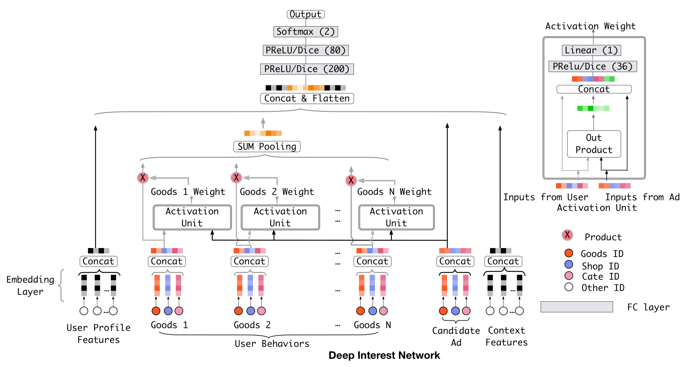

# DIN模型复现（PyTorch）
DIN（Deep Interest Network）是一种基于深度学习的点击率预测模型，旨在捕捉用户兴趣的动态变化。本文档介绍了DIN模型的复现过程，包括数据集准备、数据预处理、构建交互序列数据集以及模型训练等步骤。



TAGS: 排序、点击率预测、深度学习、兴趣建模

## 数据集准备
根据论文中的Table2，作者使用了[Amazon Reviews 2014](https://jmcauley.ucsd.edu/data/amazon)的电子产品Electronics的 `5-core` 数据集。
> K-cores (i.e., dense subsets): These data have been reduced to extract the k-core, such that each of the remaining users and items have k reviews each.

其中
- 用户数：192,403
- 商品数：63,001
- 类别数：801
- 样本（交互）数：1,689,188


建议始终在**仓库根目录**执行以下命令，不要先 `cd DIN.2017/utils` 再运行脚本。

如需拉取项目并进入目录：
```bash
git clone <your_repo_url> MyRecSys
cd MyRecSys
```

如果本地已有仓库，先更新后进入目录：
```bash
cd MyRecSys
git pull
```

下载并解压数据到 `DIN.2017/raw_data/`（可重复执行）：
```bash
mkdir -p DIN.2017/raw_data
cd DIN.2017/raw_data
wget -c http://snap.stanford.edu/data/amazon/productGraph/categoryFiles/reviews_Electronics_5.json.gz
wget -c http://snap.stanford.edu/data/amazon/productGraph/categoryFiles/meta_Electronics.json.gz
gzip -dk reviews_Electronics_5.json.gz
gzip -dk meta_Electronics.json.gz
cd ../..
```
## 数据预处理
使用 `DIN.2017/utils/1_convert_pd.py` 脚本将原始的Meta（商品信息）和Review（用户交互）数据转换为pkl格式。得到：

- reviews.pkl：包含用户-商品交互信息
- meta.pkl：包含商品的元数据

```bash
python DIN.2017/utils/1_convert_pd.py
```

随后对物品和用户进行重新编号，生成 `remap.pkl`。

```bash
python DIN.2017/utils/2_remap_id.py
```

此处可根据输出信息核对数据数量。


## 构建数据集（交互序列）
由于DIN模型需要用户的历史交互序列作为输入，因此需要基于时间戳对用户的交互行为进行排序，并构建训练、验证和测试集。

使用脚本构建交互序列数据集。

```bash
python DIN.2017/utils/3_build_dataset.py
```

得到 `dataset.pkl`，包含训练和测试集的交互序列数据。

### 数据组织形式
随机采样与正样本数量相同数量的负样本
```
pos_list: [13179, 17993, 28326, 29247, 62275]
neg_list: [50997, 28883, 7657, 490, 5940]
```

一个序列从不同的历史交互长度切分得到多个训练样本，例如：
```
train_set:
[(0, [13179], 17993, 1), (0, [13179], 28883, 0), ...]
[(30, [13179, 17993, 28326], 29247, 1), (30, [13179, 17993, 28326], 490, 0)]
```
训练集定义：（user_id, [历史交互的item_id列表], target_item_id, label）

其中label=1表示正样本（用户点击了目标商品），label=0表示负样本（从未点击的商品中随机采样得到）。

将正负样本组合配对，形成测试集：
```
test_set:
[(0, [13179, 17993, 28326, 29247], (62275, 5940)), ...]
[(30, [13179, 17993, 28326, 29247], (490, 7657)), ...]
```

测试集定义：（user_id, [历史交互的item_id列表], (正样本target_item_id, 负样本target_item_id)）

每个测试样本包含一个正样本和一个负样本，用于评估模型的区分能力。

此外使用分类别列表 `cate_list` 存储每个商品对应的类别ID，作为除ID外的物品特征输入。


## 训练
使用 `DIN.2017/train.py` 脚本训练DIN模型。

```bash
python DIN.2017/train.py
```

其中每个step会写入Metrics到TensorBoard，训练日志保存在 `DIN.2017/output/tb_logs` 目录下。可以使用以下命令启动TensorBoard进行可视化

```bash
  tensorboard --logdir=DIN.2017/output/tb_logs
```

训练过程中会保存模型检查点到 `DIN.2017/output/checkpoint/` 目录下，每个epoch保存一个模型文件 `din_model_epoch{epoch}.pth`。

## 评估
使用 `test.py` 脚本评估模型性能，计算AUC指标。

需要修改 `model_path = 'din_model.pth'` 为训练保存的模型路径。

```bash
python DIN.2017/test.py
```

## 预期结果（复现效果）
- 官方论文实现中 DIN 和 DIN with Dice 在 Amazon Electronics 5-core 数据集上的 AUC 均为 0.88 左右。
- 本次复现大约第3个epoch达到best，hidden_dim = embedding_dim = 64 时，AUC约为0.83，还有进一步的调参空间。

### Reference
- 论文链接：
  - [Deep Interest Network for Click-Through Rate Prediction](https://arxiv.org/abs/1706.06978)
  - [1706.06978v1.pdf](https://arxiv.org/pdf/1706.06978v1)

- 原作者代码：[DeepInterestNetwork(TensorFlow)](https://github.com/zhougr1993/DeepInterestNetwork)

- 相关博客：
  - [推荐系统（十一）阿里深度兴趣网络（一）：DIN模型（Deep Interest Network）-CSDN博客](https://blog.csdn.net/u012328159/article/details/123043033)
  - [【总结】推荐系统——精排篇【3】DIN/DIEN/BST/DSIN/MIMN/SIM/CAN](https://www.zhihu.com/tardis/zm/art/433135805?source_id=1003)
